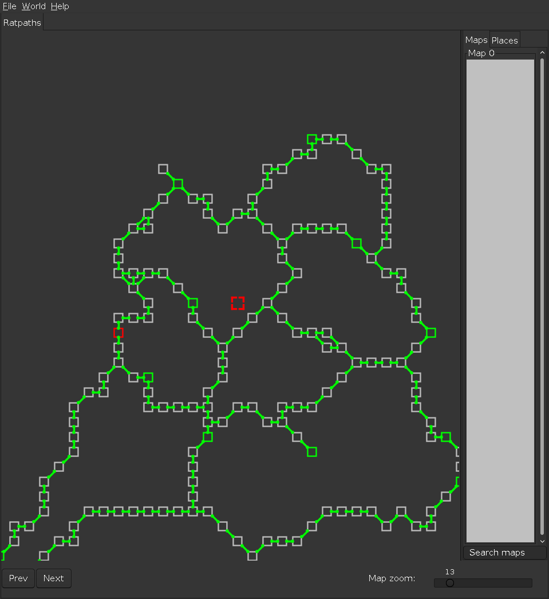
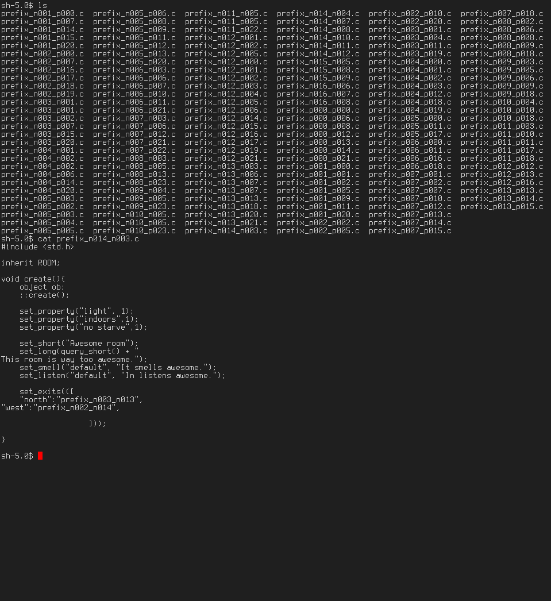

Mudmap2 to lpc converter
========================

This tool converts visual maps made in
[mud mapper 2](https://github.com/Neop/mudmap2)
into area dir based on a given template.

Requirements
------------
To use this script you'll need tcl and tcllib (for ::json)

Usage
-----

    ./mm2lpc -t template.file.c -d dir/to/write/area/files -p rooms_filename_prefix -m mudmap2.file.m2w

Default options are listed in the scripts head.

Screenshots
-----------

MM2 map:

Dir structure:

